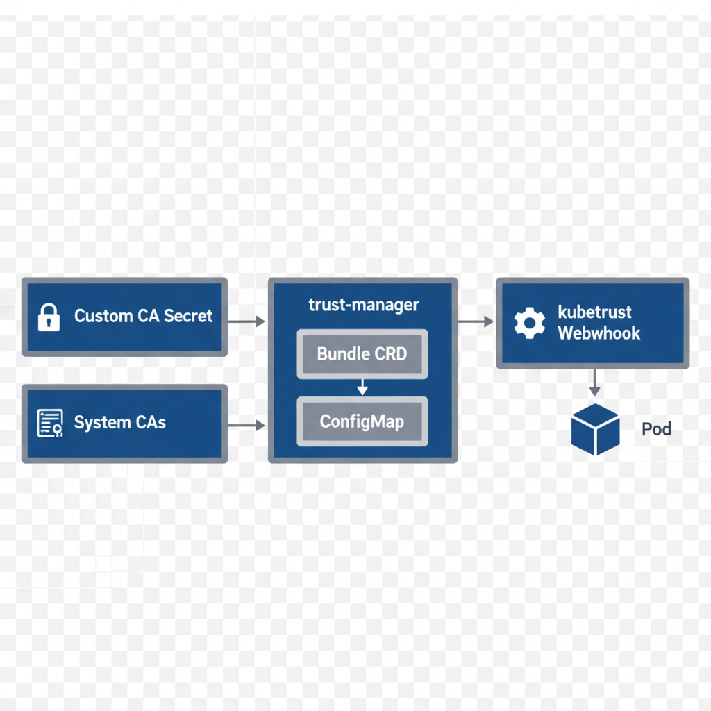

# How kubetrust Works with trust-manager

> **Note**: trust-manager is automatically installed as a subchart when you deploy kubetrust. No separate installation is required!

## Architecture Overview




## Step-by-Step Flow

### 1. Custom CA Certificate Storage
Your custom CA certificate is stored as a Kubernetes Secret:
```yaml
apiVersion: v1
kind: Secret
metadata:
  name: custom-ca-secret
  namespace: kubetrust-system
type: Opaque
data:
  ca.pem: <base64-encoded-ca-cert>
```

### 2. Bundle CRD Configuration
trust-manager's Bundle CRD combines multiple CA sources:
```yaml
apiVersion: trust.cert-manager.io/v1alpha1
kind: Bundle
metadata:
  name: trust-bundle
spec:
  sources:
  - useDefaultCAs: true              # Include system CAs
  - secret:
      name: "custom-ca-secret"       # Your custom CA
      key: "ca.pem"
  target:
    configMap:
      key: "trust-bundle.pem"        # Output ConfigMap key
```

### 3. Trust Bundle ConfigMap Creation
trust-manager automatically creates and maintains a ConfigMap:
```yaml
apiVersion: v1
kind: ConfigMap
metadata:
  name: trust-bundle
  namespace: default
data:
  trust-bundle.pem: |
    -----BEGIN CERTIFICATE-----
    # System CA 1
    -----END CERTIFICATE-----
    -----BEGIN CERTIFICATE-----
    # System CA 2
    -----END CERTIFICATE-----
    -----BEGIN CERTIFICATE-----
    # Your Custom CA
    -----END CERTIFICATE-----
    # ... more CAs ...
```

### 4. Webhook Mutation
The kubetrust webhook intercepts pod creation in labeled namespaces and injects:
```yaml
apiVersion: v1
kind: Pod
spec:
  volumes:
  - name: ca-certificates
    configMap:
      name: trust-bundle              # References the trust bundle ConfigMap
      items:
      - key: trust-bundle.pem
        path: ca-certificates.crt
  
  containers:
  - name: app
    volumeMounts:
    - name: ca-certificates
      mountPath: /etc/ssl/certs/
      readOnly: true
    - name: ca-certificates
      mountPath: /var/lib/ca-certificates/ca-bundle.pem
      subPath: ca-certificates.crt
      readOnly: true
```

## Configuration Flow

### User Configuration (values.yaml)
```yaml
customCA:
  pem: |
    -----BEGIN CERTIFICATE-----
    # Your custom CA certificate
    -----END CERTIFICATE-----

webhook:
  caInjection:
    configMapName: "trust-bundle"      # Which ConfigMap to mount
    configMapKey: "trust-bundle.pem"   # Which key in the ConfigMap
    certFileName: "ca-certificates.crt" # Filename when mounted
```

### What Gets Created

1. **Secret**: `custom-ca-secret` (contains your CA)
2. **Bundle CRD**: `trust-bundle` (configuration for trust-manager)
3. **ConfigMap**: `trust-bundle` (created by trust-manager, contains consolidated bundle)
4. **MutatingWebhookConfiguration**: Intercepts pod creation
5. **Mutated Pods**: Have trust bundle mounted at standard locations

## Key Points

### ✅ What the Webhook Mounts
- **ConfigMap**: The trust bundle ConfigMap created by trust-manager
- **NOT**: The Secret containing your custom CA directly
- **Contains**: System CAs + Your custom CA(s)

### ✅ Why This Design?
1. **Separation of Concerns**: trust-manager handles CA consolidation, webhook handles injection
2. **Flexibility**: Easy to add/remove CA sources without changing webhook
3. **Updates**: trust-manager automatically updates ConfigMap when CA sources change
4. **Standard Format**: All CAs in a single, standard PEM bundle format

### ✅ Configuration Points
You can customize:
- **ConfigMap Name**: `webhook.caInjection.configMapName`
- **ConfigMap Key**: `webhook.caInjection.configMapKey`
- **Mount Filename**: `webhook.caInjection.certFileName`

This allows using different trust bundles or trust-manager configurations.

## Example: Adding Multiple CA Sources

```yaml
apiVersion: trust.cert-manager.io/v1alpha1
kind: Bundle
metadata:
  name: trust-bundle
spec:
  sources:
  # Include default system CAs
  - useDefaultCAs: true
  
  # Your internal root CA
  - secret:
      name: "internal-root-ca"
      key: "ca.crt"
  
  # Your partner's CA
  - secret:
      name: "partner-ca"
      key: "ca.pem"
  
  # Another CA from a different namespace
  - secret:
      name: "other-ca"
      key: "tls.crt"
  
  # ConfigMap source (if needed)
  - configMap:
      name: "legacy-ca-bundle"
      key: "ca-bundle.crt"
  
  target:
    configMap:
      key: "trust-bundle.pem"
    # Can also target namespaceSelector to sync to multiple namespaces
    namespaceSelector:
      matchLabels:
        trust: enabled
```

## Troubleshooting

### ConfigMap Not Found
```bash
# Check Bundle CRD exists
kubectl get bundle trust-bundle

# Check Bundle status
kubectl describe bundle trust-bundle

# Check trust-manager logs
kubectl logs -n cert-manager -l app.kubernetes.io/name=trust-manager

# Verify ConfigMap was created
kubectl get configmap trust-bundle
```

### Pods Not Getting Certificates
```bash
# Check namespace is labeled
kubectl get namespace default --show-labels

# Verify webhook is running
kubectl get pods -n kubetrust-system

# Check webhook configuration
kubectl get mutatingwebhookconfiguration kubetrust

# Test pod mutation
kubectl run test --image=nginx
kubectl get pod test -o yaml | grep -A 20 volumes
```

### Certificates Not Updated
trust-manager automatically updates the ConfigMap when sources change, but pods need to be restarted:
```bash
# Restart pods to pick up new certificates
kubectl rollout restart deployment/<name>

# Or delete and recreate
kubectl delete pod <pod-name>
```

## References

- [trust-manager Documentation](https://cert-manager.io/docs/trust/trust-manager/)
- [Bundle CRD Reference](https://cert-manager.io/docs/trust/trust-manager/api-reference/)
- [Kubernetes Admission Controllers](https://kubernetes.io/docs/reference/access-authn-authz/admission-controllers/)
