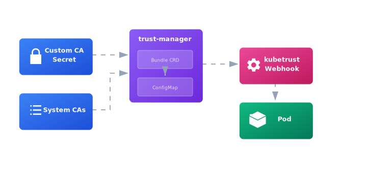

<h1 align="center">
   kubetrust
</h1>


[](LICENSE)
[](https://kubernetes.io/)
[](https://helm.sh/)

## Overview

**kubetrust** is a Kubernetes mutating admission webhook that automatically injects CA certificates into pods running in labeled namespaces. It integrates with [cert-manager's trust-manager](https://cert-manager.io/docs/trust/trust-manager/) to consolidate system CAs and custom CA certificates into a single trust bundle, then mounts that bundle into application pods at runtime.

### Key Features

- ✅ **Runtime Configuration** - No hardcoded certificates, fully configurable via Helm
- ✅ **Zero-Downtime CA Updates** - Update CA certificates without rebuilding images or application downtime
- ✅ **Automatic Certificate Generation** - Helm hooks generate webhook TLS certificates automatically
- ✅ **Custom CA Support** - Easily inject your organization's CA certificates
- ✅ **trust-manager Integration** - Automatically installed as a subchart for CA bundle management
- ✅ **Namespace-Based Injection** - Control which namespaces receive CA certificates via labels
- ✅ **Single Image** - One container image works across all deployments
- ✅ **Production Ready** - High availability support, documented best practices

## Architecture

kubetrust works by:

1. **Storing CAs**: Custom CA certificates are stored in Kubernetes Secrets
2. **Bundling**: trust-manager's Bundle CRD combines custom CAs with system CAs into a ConfigMap
3. **Injecting**: The webhook automatically mounts this ConfigMap into pods in labeled namespaces



📖 **[Detailed Architecture Documentation](ARCHITECTURE.md)**

## Prerequisites

- Kubernetes cluster 1.19+
- Helm 3.0+
- Container registry (for self-hosted webhook)

## Quick Start

### Installation

```bash
# Clone the repository
git clone https://github.com/kubetrust/kubetrust.git
cd kubetrust

# Update chart dependencies (downloads trust-manager)
cd chart
helm dependency update

# Install kubetrust
helm install kubetrust . \
  --namespace kubetrust-system \
  --create-namespace
```

### Label Namespaces

Enable CA injection for specific namespaces:

```bash
kubectl label namespace default kubetrust=enabled
kubectl label namespace production kubetrust=enabled
```

### Verify Installation

```bash
# Check webhook is running
kubectl get pods -n kubetrust-system

# Deploy a test pod
kubectl run test-nginx --image=nginx -n default

# Verify CA certificates are mounted
kubectl exec test-nginx -- ls -la /etc/ssl/certs/
kubectl get pod test-nginx -o yaml | grep -A 10 volumeMounts
```

## Configuration

### Adding Custom CA Certificates

Create a `custom-values.yaml`:

```yaml
customCA:
  pem: |
    -----BEGIN CERTIFICATE-----
    MIIDXTCCAkWgAwIBAgIJAKL0UG+mRkmLMA0GCSqGSIb3...
    -----END CERTIFICATE-----

targetNamespaces:
  - default
  - production
```

Install with custom values:

```bash
helm install kubetrust ./chart \
  -n kubetrust-system --create-namespace \
  -f custom-values.yaml
```

### Key Configuration Parameters

| Parameter                           | Description                        | Default               |
| ----------------------------------- | ---------------------------------- | --------------------- |
| `webhook.image.repository`          | Webhook container image            | `karthickk/kubetrust` |
| `webhook.image.tag`                 | Image tag                          | `latest`              |
| `webhook.replicas`                  | Number of webhook replicas         | `1`                   |
| `customCA.pem`                      | Custom CA certificate (PEM format) | `""`                  |
| `webhook.caInjection.configMapName` | ConfigMap with CA bundle           | `trust-bundle`        |
| `webhook.caInjection.configMapKey`  | Key in ConfigMap                   | `trust-bundle.pem`    |
| `targetNamespaces`                  | Namespaces to auto-label           | `[]`                  |

📖 **Full configuration reference**: See [chart/values.yaml](chart/values.yaml)

### Environment Variables

The webhook supports runtime configuration via environment variables (automatically set by Helm):

| Variable            | Description                     | Default               |
| ------------------- | ------------------------------- | --------------------- |
| `TLS_CERT_FILE`     | Path to webhook TLS certificate | `./ssl/kubetrust.pem` |
| `TLS_KEY_FILE`      | Path to webhook TLS key         | `./ssl/kubetrust.key` |
| `CA_CONFIGMAP_NAME` | ConfigMap with CAs to inject    | `trust-bundle`        |
| `CA_CONFIGMAP_KEY`  | Key in ConfigMap                | `trust-bundle.pem`    |
| `CA_CERT_FILENAME`  | Filename when mounted in pods   | `ca-certificates.crt` |

## Building from Source

```bash
# Build the application
cd build
make app

# Build and tag the image
docker build -t your-registry.com/kubetrust/webhook:v1.0.0 .
docker push your-registry.com/kubetrust/webhook:v1.0.0

# Deploy with custom image
helm install kubetrust ./chart \
  -n kubetrust-system --create-namespace \
  --set webhook.image.repository=your-registry.com/kubetrust/webhook \
  --set webhook.image.tag=v1.0.0
```

## Documentation

- **[ARCHITECTURE.md](ARCHITECTURE.md)** - Detailed architecture and flow diagrams
- **[chart/README.md](chart/README.md)** - Helm chart documentation

## Troubleshooting

### Webhook Pod Not Starting

```bash
kubectl logs -n kubetrust-system -l app=mutateme
kubectl describe pod -n kubetrust-system -l app=mutateme
```

### Pods Not Getting Certificates

```bash
# Verify namespace is labeled
kubectl get namespace default --show-labels

# Check webhook configuration
kubectl get mutatingwebhookconfiguration kubetrust -o yaml

# View webhook logs
kubectl logs -n kubetrust-system -l app=mutateme
```

### ConfigMap Not Found

```bash
# Check Bundle CRD
kubectl get bundle trust-bundle

# Check trust-manager logs
kubectl logs -n cert-manager -l app.kubernetes.io/name=trust-manager

# Verify ConfigMap exists
kubectl get configmap trust-bundle
```

## Contributing

We welcome contributions! Please see our contributing guidelines:

1. Fork the repository
2. Create a feature branch (`git checkout -b feature/amazing-feature`)
3. Commit your changes (`git commit -m 'Add amazing feature'`)
4. Push to the branch (`git push origin feature/amazing-feature`)
5. Open a Pull Request

## Community

- **Issues**: Report bugs and request features via [GitHub Issues](https://github.com/kubetrust/kubetrust/issues)
- **Discussions**: Join the conversation in [GitHub Discussions](https://github.com/kubetrust/kubetrust/discussions)

## Code of Conduct

This project follows the [CNCF Code of Conduct](https://github.com/cncf/foundation/blob/main/code-of-conduct.md).

## License

This project is licensed under the Apache License 2.0 - see the [LICENSE](LICENSE) file for details.

## Acknowledgments

- Built with [cert-manager/trust-manager](https://cert-manager.io/docs/trust/trust-manager/)
- Inspired by Kubernetes admission controller patterns

## Related Projects

- [cert-manager](https://cert-manager.io/) - X.509 certificate management for Kubernetes
- [trust-manager](https://cert-manager.io/docs/trust/trust-manager/) - Certificate trust bundle distribution
